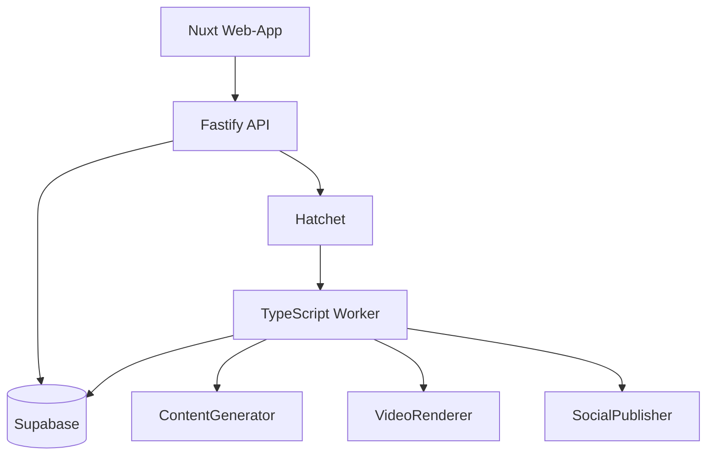
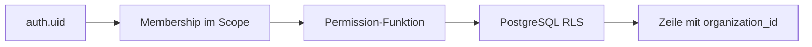

# Systemarchitektur

Supabase ist die fachliche Source of Truth. Hatchet verwaltet ausschließlich technische Ausführung. Provider liegen hinter Interfaces; der lokale Start verwendet sichere Fake-Implementierungen.

## Abhängigkeitsrichtung

`apps/* → packages/*`. Domain, Contracts und Authorization importieren keine Frameworks oder Provider-SDKs. Browser-Code kennt keine Service-Role und greift für privilegierte Aktionen auf die Fastify-API zu.

## Tenant-Grenze

RLS ist auf exponierten Tabellen aktiviert und erzwungen. Organisatorische Unterobjekte werden mit zusammengesetzten Fremdschlüsseln an ihren Mandanten gebunden.
