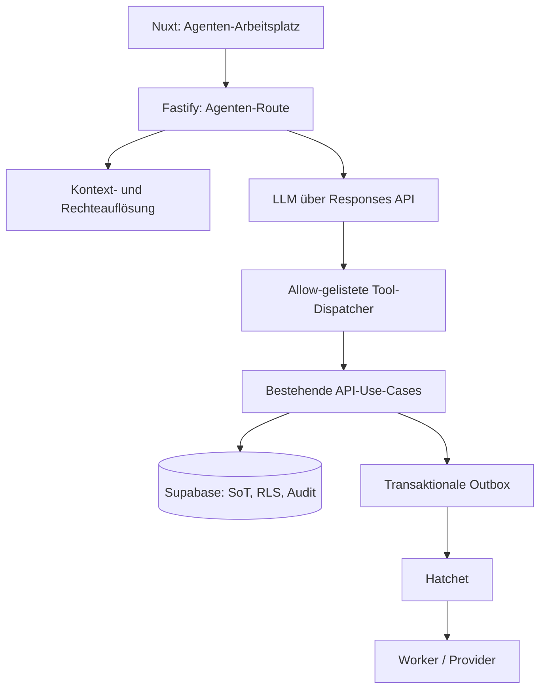

# Plan: Dialogischer Vereinsagent und Agenten-Arbeitsplatz

Stand: 24. August 2026
Status: Pakete A–C umgesetzt; Paket D enthält die bestätigte Planung, während direkte
Veröffentlichung, Reconciliation und Pilot weiterhin ausstehen.

Die konkrete Übergabe mit geprüftem Stand und dem nächsten Umsetzungsschritt steht
in [Agenten-Arbeitsplatz: aktuelle Übergabe](agent-workspace-handoff.md).

## 1. Produktziel und Grenzen

Der Agenten-Arbeitsplatz ist die bevorzugte Bedienoberfläche für wiederkehrende
Vereinsarbeit. Ein Nutzer soll sein Ziel formulieren können, statt dafür die
passende Navigation und Reihenfolge von Einzelschritten kennen zu müssen.

Beispiele:

- „Lade Lara als Redakteurin für die Fußballabteilung ein.“
- „Lege für Samstag 14 Uhr ein Sommerfest an und bereite einen Instagram-Beitrag vor.“
- „Welche Beiträge warten diese Woche auf mich?“
- „Plane den freigegebenen Spielbericht für morgen 18 Uhr auf Instagram und Facebook.“

Der Agent ersetzt weder die fachlichen Regeln noch die Verantwortung eines Nutzers.
Er erklärt, sucht, strukturiert Fakten und bereitet Aktionen vor. Er darf weder
Freigaberegeln umgehen noch Inhalte, Termine, Einladungen oder Veröffentlichungen
unbemerkt ausführen.

Nicht Teil der ersten Ausbaustufe sind Sprachsteuerung, autonome Langzeitaufgaben,
Bild-/Videoanalyse oder ein externer ChatGPT-/Codex-Zugang über MCP.

## 2. Architekturentscheidung

ADR-012 legt fest: Zuerst entsteht eine interne Agenten-Command-Plane in der
Fastify-API; ein Remote-MCP ist später lediglich ein optionaler Adapter darauf.



Die Web-App kommuniziert ausschließlich mit Fastify. Fastify verwaltet Session,
Conversation, Tool-Aufrufe, Bestätigungen und Streaming. Der Worker bleibt für
asynchrone Generierung, Rendering und Publishing zuständig. Hatchet erhält dabei
weiterhin nur IDs und technische Metadaten.

Die Command-Plane teilt Use Cases mit den bestehenden HTTP-Routen. Sie ist keine
zweite Sammlung von direkten Datenbankzugriffen und kein Service-Role-Proxy für das
Modell.

## 3. Agenten-Arbeitsplatz in Nuxt

Neue Route: `/assistent`.

Die Seite ist ein Arbeitsbereich statt einer bloßen Nachrichtenliste:

- Eine Chat-Spalte für Ziele, Rückfragen, Antworten und Fortschrittsmeldungen.
- Inline-Aktionskarten für Entwürfe, Einladungen, Termine, Freigaben und
  Veröffentlichungen.
- Eine kontextsensitive Detailansicht für Beitragsvorschau, Fakten, Warnungen,
  Status, Plattformen und geplante Zeiten.
- Sichtbarer aktiver Scope (Verein, Abteilung, optional Mannschaft) und die
  Fähigkeit, bei Mehrdeutigkeit gezielt nachzufragen.
- „Offene Punkte“ als kleine Liste: fehlende Fakten, ausstehende Freigaben,
  fehlgeschlagene Workflows und abgelaufene Bestätigungen.

Die bekannten Fachseiten bleiben bestehen. Jede Aktionskarte verlinkt auf den
konkreten Datensatz bzw. die Fachseite, damit ein Nutzer jederzeit in die detailreiche
Bedienung wechseln kann.

### Gesprächsregeln

Der Agent antwortet auf Deutsch, konkret und knapp. Er nennt fehlende Fakten und
Blocker offen; er erfindet sie nie. Bei einer mehrdeutigen Organisation, Abteilung,
Mannschaft, Person oder einem Beitrag fragt er nach, statt den wahrscheinlichsten
Datensatz auszuwählen.

Er darf Fakten für einen Beitrag nur aus bestätigten Eingaben, vorhandenen,
berechtigten Datensätzen oder explizit angenommenen Vorschlägen übernehmen. Für
Beiträge gelten ADR-003, ADR-005, ADR-006, ADR-010 und ADR-011 unverändert.

## 4. Datenmodell, Speicherung und Datenschutz

Alle neuen Tabellen sind mandantenbezogen, besitzen `organization_id`, passende
zusammengesetzte Fremdschlüssel, RLS und positive wie negative Isolationstests.

| Tabelle | Zweck | Wesentliche Felder |
|---|---|---|
| `agent_conversations` | Gesprächsstamm und aktiver Scope | `organization_id`, `department_id`, `team_id`, `created_by`, `last_activity_at`, `archived_at` |
| `agent_messages` | Anzeige- und Wiederaufnahmekontext | `conversation_id`, `organization_id`, `role`, `content`, `redacted_content`, `created_by`, `retention_expires_at` |
| `agent_action_proposals` | unveränderlicher, bestätigbarer Aktionsvorschlag | `conversation_id`, `tool_name`, `scope_snapshot`, `input_snapshot`, `input_hash`, `target_refs`, `risk_class`, `status`, `expires_at`, `confirmed_by` |
| `agent_tool_runs` | operative Diagnose ohne sensible Payloads | `conversation_id`, `proposal_id`, `tool_name`, `correlation_id`, `status`, `result_refs`, `error_code`, `started_at`, `finished_at` |

`agent_messages.content` wird nur gespeichert, wenn dies für die Gesprächsfortsetzung
benötigt und rechtlich freigegeben ist. Sonst wird lediglich ein minimierter,
redigierter Gesprächszustand gespeichert. Alle Tabellen erhalten festgelegte
Aufbewahrungsregeln, Export- und Löschunterstützung sowie Auditierung für Zugriff,
Änderung und Löschung.

An den Modellanbieter gehen nur die aktuelle Nutzereingabe, feste
Sicherheitsinstruktionen und kleine, fachlich notwendige Tool-Ergebnisse. Nicht an
das Modell gehen: Service-Role- oder Provider-Secrets, Rohmedien, Medienbytes,
Signed URLs, Elternkontakte, vollständige Verzeichnisdaten, interne Audit-Details
oder unverarbeitete Datenbankzeilen. Der bestehende Text-only-Grundsatz bleibt:
Fotos und Videos werden nicht an das LLM übertragen.

Die Responses-Integration wird serverseitig mit `store: false` betrieben, sofern
keine bewusst beschlossene Ausnahme vorliegt. Die eigene Gesprächspeicherung bleibt
die steuerbare Source of Truth. Die [OpenAI-Dokumentation zu Datenkontrollen](https://developers.openai.com/api/docs/guides/your-data#default-usage-policies-by-endpoint)
weist darauf hin, dass die Responses API ohne entsprechende Einstellung
Anwendungszustand speichern kann und dass Daten an Remote-MCP-Server deren eigenen
Aufbewahrungsregeln unterliegen.

## 5. Tool- und Command-Modell

Jedes Tool hat einen Namen, ein striktes Zod-Eingabe- und Ausgabe-Schema,
eine Risiko-Klasse, erforderliche Permissions, idempotentes Verhalten und dokumentierte
Fehlercodes. Der Dispatcher akzeptiert ausschließlich die in dieser Registry
freigegebenen Tools.

```ts
type AgentTool<I, O> = {
  name: string
  input: z.ZodType<I>
  output: z.ZodType<O>
  requiredPermissions: readonly Permission[]
  risk: 'read' | 'draft' | 'write' | 'external'
  execute(context: AgentExecutionContext, input: I): Promise<O>
}
```

`AgentExecutionContext` wird ausschließlich im Server erzeugt. Er enthält die
authentifizierte `profile_id`, den erlaubten Scope, die aufgelösten Permissions,
eine Correlation-ID und niemals ein vom Browser behauptetes Benutzer- oder
Organisationseigentum.

### Tool-Katalog der ersten Ausbaustufen

| Stufe | Tool-Familie | Beispiele | Ausführung |
|---|---|---|---|
| Lesen | Überblick und Suche | `get_workspace_overview`, `find_posts`, `get_post_details`, `list_pending_approvals`, `find_events` | sofort |
| Entwurf | Fakten und Vorschläge | `create_content_brief`, `propose_event`, `propose_invitation`, `prepare_post_generation` | sofort, aber noch keine Fachmutation |
| Bestätigte Mutation | interne, fachliche Änderung | `create_event`, `update_event`, `create_invitation`, `accept_generated_post_version`, `request_approval` | Aktionskarte + Bestätigung |
| Extern | kosten- oder außenwirksame Aktion | `start_text_generation`, `schedule_post`, `publish_post`, `resend_invitation` | Aktionskarte + Bestätigung; bei Publishing stets final |

Eine erste Tool-Registry bleibt bewusst klein. Funktionen für Rollenänderungen,
Einwilligungen, Social-Account-Verbindungen, Löschungen, Abrechnung und
Datenschutzanfragen werden erst ergänzt, wenn je eigene Freigabe- und Testkonzepte
vorliegen.

Tool-Ausgaben enthalten strukturierte Referenzen und benutzerfreundliche
Zusammenfassungen, keine rohe Datenbankantwort. Beispiel: `find_posts` liefert
post-ID, Titel, Status, relevante Zeit und Scope – nicht den kompletten Inhalt
aller Versionen.

## 6. Aktionsvorschläge und Bestätigung

Die Agentenantwort kann nie selbst eine Mutation ausführen. Bei einer Mutation
erstellt der Server einen Aktionsvorschlag und gibt eine Karte zurück.

```text
Nutzereingabe → Tool plant Aktion → Server validiert und erstellt Proposal
→ UI zeigt Wirkung, Scope, Risiken und betroffene Ressourcen
→ Nutzer bestätigt → Server prüft alles erneut → Use Case führt Aktion aus
→ Audit/Event/Outbox → Ergebnis zurück in die Unterhaltung
```

Ein Proposal bindet:

- den angemeldeten Nutzer und seine Session,
- den Organisations-, Abteilungs- und Mannschaftsscope,
- Toolname und kanonischen Payload-Hash,
- Zielreferenzen, insbesondere `post_version_id` und Derivat-Hashes,
- Risiko-Klasse, Erstellzeit und kurze Ablaufzeit,
- bei externen Aktionen einen Idempotency-Key.

Beim Bestätigen wird die Permission erneut geprüft. Ebenso prüft der Use Case,
ob Zielobjekte noch zum Scope gehören, eine Post-Version noch aktuell und freigegeben
ist, die Zustimmung noch gilt und der Statusübergang weiterhin erlaubt ist. Eine
geänderte Post-Version, ein abgelaufenes Proposal oder eine verlorene Berechtigung
führt zu einer neuen Vorschau statt zur Ausführung.

Die UI stellt bei Publishing mindestens Version, Zielplattformen, lokale
Veröffentlichungszeit, Medien-/Einwilligungsblocker und erwartete Außenwirkung
sichtbar dar. „Freigeben“ erstellt eine menschliche `approval_decision` des
angemeldeten Nutzers, keine Entscheidung des Agenten.

## 7. API und Modellorchestrierung

Neue Fastify-Routen:

- `POST /v1/agent/conversations` – Conversation im erlaubten Scope anlegen.
- `GET /v1/agent/conversations/:id` – Conversation, Nachrichten und sichere
  Aktionsreferenzen lesen.
- `POST /v1/agent/conversations/:id/messages` – Nutzereingabe validieren,
  den berechtigten Kontext aufbauen und nach Abschluss die vollständige Conversation
  mit beiden neu gespeicherten Nachrichten zurückgeben.
- `POST /v1/agent/action-proposals/:id/confirm` – Proposal atomar bestätigen
  und den fachlichen Use Case ausführen.
- `POST /v1/agent/action-proposals/:id/cancel` – Proposal verwerfen.

Paket A arbeitet noch ohne SSE: Die Route wartet auf die vollständige Agentenantwort
und liefert anschließend einen validierten JSON-Response. Der spätere Streaming-Endpunkt
übernimmt denselben Ablauf, überträgt Tool-Fortschritt und Kartenereignisse jedoch als
Ereignisstrom:

1. Bearer-Session validieren und Conversation/Scope per RLS laden.
2. Serverseitig erlaubten Agentenkontext aufbauen.
3. Response über einen versionierten Systemprompt und die Tool-Registry erzeugen.
4. Jeden Toolaufruf im Dispatcher gegen Schema, Scope und Permission validieren.
5. Tool-Fortschritt, Ergebnisreferenzen und Korrelation speichern; keine sensiblen
   Tool-Payloads loggen.
6. Antwort und Kartenereignisse an Nuxt streamen.

Die Responses API unterstützt Werkzeugaufrufe und mehrturnige Konversationen.
Die Anwendung begrenzt Calls, Schleifen, Kontextgröße und parallele Aufrufe selbst;
keine schreibende Tool-Aktion darf parallel zur Bestätigung einer anderen Aktion
auf demselben Zielobjekt laufen. [OpenAI Docs: Responses API](https://developers.openai.com/api/reference/cli/resources/responses/methods/create)

Der Systemprompt ist eine versionierte Plattformressource, nicht pro Nutzer frei
editierbar. Er instruiert über Faktenbindung, Rückfragen, Scope, das Verbot
autonomer Mutationen und die korrekte Nutzung der Tools. Prompt-Version und
Modellkonfiguration werden pro Tool-Run als nicht geheime Provenienz gespeichert.

Die Plattformadministration kann die konkrete aktive OpenAI-kompatible
Text-Provider-Konfiguration für den Agenten wählen. Die Auswahl referenziert nur
eine bestehende Konfiguration; Base-URL, Modell und verschlüsseltes Secret werden
ausschließlich serverseitig aufgelöst. Fehlt die Auswahl oder wird sie später
deaktiviert, bleibt der sichere Deployment-Fallback aktiv.

## 8. Berechtigungen, Sicherheit und Betrieb

- Jede Tool-Ausführung autorisiert erneut über die bestehenden Permission-Checks;
  versteckte UI oder der Agentenkontext sind nie eine Sicherheitsgrenze.
- Datenbankzugriffe laufen über die bestehende Auth-/Service-Role-Trennung. Die
  Service Role existiert nur im API-/Worker-Prozess und wird jeder Aktion mit
  Nutzer- oder Systemkontext auditiert.
- Jeder Tool-Run erhält eine `correlation_id`; jede Mutation ein Audit-Event.
- Externe Aktionen verwenden die vorhandenen Idempotency- und
  Reconciliation-Regeln. Ein Agenten-Retry darf keinen zweiten Post oder keine
  zweite Einladung auslösen.
- Prompt-Injection aus Beiträgen, Integrationsdaten oder Benutzereingaben wird
  als unzuverlässiger Inhalt behandelt, nicht als Instruktion. Tool-Resultate
  sind strukturierte Daten und nicht als Systeminstruktion in das Modellcontext
  einzufügen.
- Rate Limits gelten pro Nutzer, Verein, Conversation und Tool-Familie; Token-
  und Generierungskosten werden im `usage_ledger` erfasst und vor kostenpflichtigen
  Aktionen reserviert.
- Observability umfasst Tool-Auswahl, Latenz, Fehlerklasse, Bestätigungsquote,
  abgelaufene Proposals, Abbrüche, Kosten und jede Außenwirkung – ohne Rohtexte,
  Medien oder Secrets in Logs.

## 9. Umsetzungsreihenfolge

### Paket A – Fundament und Read-only-Agent

**Stand 24. August 2026:** umgesetzt. Conversation-/Message-Tabellen,
RLS-Isolation, der read-only Workspace, die serverseitige Responses-Anbindung mit
`store: false`, die lokale Fallback-Antwort und `/assistent` sind vorhanden. Die
Antwort wird im ersten Schnitt noch als vollständige API-Antwort übertragen;
Tool-Streaming und schreibende Tools folgen erst zusammen mit dem
Proposal-/Bestätigungs-Lifecycle, damit keine halbfertige Mutationsroute live geht.

1. ADR-012 und diesen Plan als Architektur-Baseline übernehmen.
2. `packages/contracts` um Conversation-, Proposal-, Stream- und Tool-Schemas
   erweitern; reine Policy-/Hash-Funktionen nach `packages/domain`.
3. Migrationen für Conversations, Messages, Proposals und Tool-Runs mit RLS,
   zusammengesetzten Fremdschlüsseln, Retention-Job und pgTAP-Isolationstests.
4. Gemeinsame API-Use-Case-Grenze definieren; zunächst bestehende lesende Endpunkte
   über eine kleine Tool-Registry exponieren.
5. Fastify-Streamingroute und Nuxt-Route `/assistent` mit Scope-Anzeige,
   Gespräch, Tool-Fortschritt und Fehlerzuständen bauen.
6. Evals für Übersicht, Beitrags-/Event-Suche, Mehrdeutigkeit und fehlende
   Berechtigung einführen.

Abnahme: Ein berechtigter Nutzer kann in seinem Scope natürlichsprachlich offene
Freigaben, Beiträge und Termine finden; Verein B bleibt in allen RLS- und
Tool-Tests unsichtbar.

### Paket B – Sichere Vorschläge und bestätigte interne Aktionen

1. Proposal-Lifecycle mit Payload-Hash, Ablauf, Cancel und atomarer Bestätigung.
2. `propose_event`/`create_event` und `propose_invitation`/`create_invitation`
   über bereits bestehende Use Cases anbinden.
3. Aktionskarten mit vollständiger Vorschau, Bestätigen/Verwerfen und Deep Links.
4. Audit-, Idempotenz- und verlorene-Session-Fehlerpfade ergänzen.

Abnahme: Der Agent kann Events und Einladungen vorbereiten, aber ohne explizite
Bestätigung keine Daten oder E-Mails verändern bzw. versenden.

Umgesetzt am 24. August 2026: kanonischer SHA-256-Payload-Hash, Ablauf, Cancel,
atomare Execution-Reservation, erneute Berechtigungs- und Scope-Prüfung sowie
Audit- und Tool-Run-Diagnose. Die Responses-Tool-Registry kennt ausschließlich
`create_event` und `create_invitation`; der Provider erhält keinen direkten
Datenbank- oder Versandzugriff. Die Einladungsaktion verwendet denselben
fachlichen Use Case wie die reguläre Einladungsroute. In `/assistent` erscheinen
die Vorschläge mit Ablauf sowie Bestätigen/Verwerfen; erst die Bestätigung führt
die Aktion aus.

### Paket C – Dialogischer Content- und Freigabeflow

1. Content-Brief aus bestätigten Fakten erstellen und fehlende Angaben abfragen.
2. Kostenpflichtige Textgenerierung als bestätigte Aktion an den bestehenden
   Generation-Workflow anbinden.
3. Kandidat und Fakten-/Safety-Flags als Karten anzeigen; Übernahme erzeugt wie
   bisher eine immutable Post-Version.
4. Freigabe anfordern und Entscheidungen nur innerhalb der etablierten
   `approval_policy`- und `review_route`-Regeln ermöglichen.

Abnahme: Eine Chat-Unterhaltung kann einen faktengebundenen Entwurf bis zur
Freigabe führen; eine geänderte Version, Minderjährigenflag oder fehlende
Permission stoppt den Prozess sicher.

Umgesetzt am 24. August 2026: Das bestätigte Tool `request_approval` ist
angebunden. Es akzeptiert ausschließlich eine aktuelle Beitragsversion aus dem
Conversation-Scope, prüft Scope und `post.submit` beim Vorschlag und vor der
Ausführung erneut und ruft die vorhandene `request_approval`-Fach-RPC auf.
`save_content_brief` speichert ausschließlich bestätigte Fakten als Textwerkstatt-Entwurf
über den gemeinsamen Draft-Use-Case. `start_text_generation` ist ein separater,
kostenpflichtiger Bestätigungsschritt und nutzt denselben API-Use-Case wie die
Textwerkstatt: Scope, Richtlinien, Plattformverfügbarkeit, Provider-Konfiguration,
idempotente Session-RPC und Outbox/Worker bleiben identisch. Bereite Textkandidaten
werden nur aus dem aktuellen Scope in den Modellkontext aufgenommen;
`accept_text_candidate` erzeugt nach einer erneuten Bestätigung eine unveränderliche
Post-Version. Kandidaten mit Medien werden bewusst an die Textwerkstatt verwiesen,
damit deren sichtbare Personenprüfung und Derivatlogik nicht umgangen werden.
Aktionsresultate tragen strukturierte Referenzen und verlinken zur Textwerkstatt;
die bestehende Freigabeaktion schließt den Chatpfad bis zur Freigabe ab.

### Paket D – Planung, Publishing und Pilot

**Stand 24. August 2026:** Schritt 1 und 2 sind umgesetzt. Der Workspace liefert
freigegebene aktuelle Versionen; `schedule_publication` wählt exakt einen erlaubten
Instagram- oder Facebook-Kanal, erzeugt einen bestätigungspflichtigen Vorschlag
und ruft nach Re-Autorisierung die bestehende, idempotente Scheduling-RPC auf.
Die Agenten-UI zeigt den geplanten Zeitpunkt und macht klar, dass das noch keine
direkte externe Veröffentlichung ist. Direkte Veröffentlichung, Reconciliation
und Pilot-Evals bleiben offen.

1. Publishing ausschließlich über die etablierte Outbox-/Hatchet-/Publisher-Kette
   und mit finaler Bestätigung anbinden.
2. Reconciliation, Fehlermeldungen und Aktivitäten in die Unterhaltung spiegeln.
3. Mit einem kleinen Pilotverein messen und Tool-Evals gegen echte,
   anonymisierte Pilotfälle erweitern.

Abnahme: Ein bestätigter, freigegebener Post wird genau einmal geplant oder
veröffentlicht; Timeout und Wiederholung führen zu Statusabgleich statt
Doppelveröffentlichung.

## 10. Test- und Eval-Matrix

| Bereich | Nachweis |
|---|---|
| Zod/Contracts | alle Tool-, Stream-, Proposal- und Fehlerantworten akzeptieren nur gültige Formen |
| Domain | Proposal-Hash, Ablauf, Risiko-Klassifikation und erlaubte Zustandsübergänge |
| API | keine Ausführung ohne Bestätigung; Re-Autorisierung und Idempotenz bei Wiederholung |
| RLS | Conversation, Nachricht, Proposal und Tool-Run sind cross-tenant und cross-scope nicht les- oder schreibbar |
| E2E | Einladung, Event, Entwurf, Freigabe, Scheduling und Publish-Happy-Path über den Agenten |
| Negativ-E2E | Prompt-Injection, fremde ID, abgelaufene Proposal, alte Post-Version, fehlende Zustimmung, Selbstfreigabe und Publishing-Timeout |
| Modell-Evals | richtige Toolwahl, Rückfrage bei Mehrdeutigkeit, keine Halluzinationen, keine autonome Ausführung |
| Last/Betrieb | Limits, Streaming-Abbruch, Wiederaufnahme, Worker-Neustart und Kostenreservierung |

Für jede mutierende Tool-Familie sind positive und negative Authorization-Tests
Merge-Blocker. Vor Paket D muss die bestehende Kennzeichnungsfrage für
KI-unterstützten Text aus ADR-010 rechtlich geklärt sein.

## 11. Optionaler MCP nach dem Pilot

Ein MCP ist erst ein eigenes Folgeprojekt, wenn die Command-Plane stabil ist und
ein klarer externer Anwendungsfall besteht. Voraussetzungen:

- versionierter, kleiner und evaluiert getesteter Tool-Katalog;
- OAuth-Delegation pro Nutzer und Organisation, keine geteilte Service Identity;
- Tool-spezifische Approval-Policies und Server-seitige Re-Autorisierung;
- eigene Rate Limits, Audit, Datenresidenz-/AVV-Prüfung und Incident-Runbook;
- keine Rohmedien, Secrets oder unnötigen Personeninformationen in Tool-Resultaten;
- Sicherheitsreview inklusive Prompt-Injection- und Tenant-Escape-Tests.

MCP-Tools dürfen die Command-Plane aufrufen, aber keine zusätzlichen fachlichen
Fähigkeiten erhalten. Solange diese Kriterien nicht erfüllt sind, bleibt das MCP
bewusst außerhalb des Produktumfangs.

## 12. Erfolgsmetriken

- Anteil der Kernaufgaben, die vollständig über den Arbeitsplatz abgeschlossen werden.
- Median der Interaktionen bis zum Erstellen eines freigabefähigen Beitrags.
- Zeit von „Beitrag vorbereiten“ bis „Freigabe angefordert“.
- Bestätigungs-, Änderungs- und Abbruchquote je Aktionsfamilie.
- Tool-/Modellfehler, falsche Toolauswahl und Anteil notwendiger menschlicher Korrekturen.
- Publishing-Duplikate und Sicherheitsverletzungen: beide Zielwert null.
- Token- und Workflow-Kosten pro erfolgreich abgeschlossener Aufgabe.
