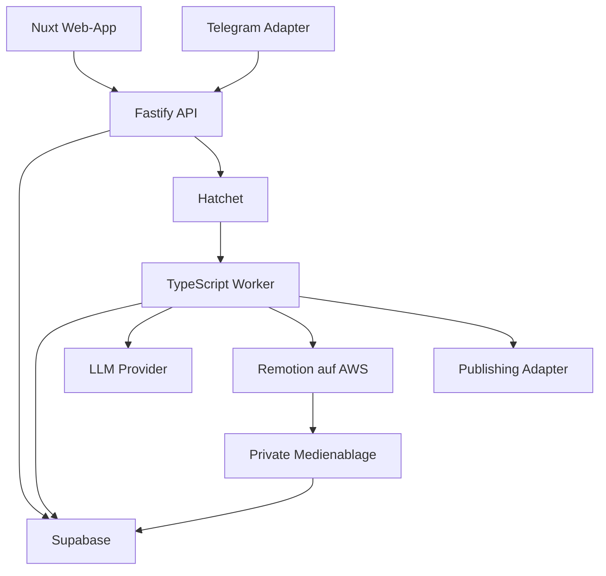

# Umsetzungsplan: Multi-Tenant Social-Media-SaaS für Sportvereine

Stand: 2. August 2026  
Status: Technischer Bauplan für MVP und produktionsfähige Weiterentwicklung

## 1. Ziel und Produktvision

Die Anwendung hilft Sportvereinen und ihren Abteilungen, mit sehr wenig Aufwand konsistente Social-Media-Inhalte zu erstellen, freizugeben, zu planen und auszuwerten.

Ein Verein ist ein Mandant (`organization`). Innerhalb eines Vereins gibt es mehrere Abteilungen (`departments`) und optional Mannschaften oder Gruppen (`teams`). Benutzer erhalten Zugriffe nicht global, sondern über Mitgliedschaften auf Vereins-, Abteilungs- oder Mannschaftsebene.

Das Produkt soll insbesondere:

- strukturierte Rohinformationen, Bilder und Videos aufnehmen,
- daraus mithilfe eines LLM verlässliche Beitragsentwürfe erzeugen,
- markenkonforme Bilder und Reels erstellen,
- einen nachvollziehbaren Freigabeprozess ermöglichen,
- Beiträge über einen austauschbaren Publishing-Adapter veröffentlichen,
- Workloads fair zwischen Vereinen und Abteilungen verteilen,
- Datenschutz, Einwilligungen und Minderjährigenschutz berücksichtigen,
- später als SaaS mit unterschiedlichen Tarifen angeboten werden können.

### 1.1 Inhaltswerkstatt und Grounding

Die Erfassung ist nicht auf Spielberichte beschränkt. Anlass (`preset_slug`), Kommunikationsziel und Ausgabeformat sind orthogonal. Die Oberfläche bietet unter anderem Ballschule, Training, Vereinsleben, Ehrenamt und einen freien Anlass prominent an. KI-Ausgaben dürfen nur bestätigte Fakten, Beobachtungen und explizit freigegebene Zitate verwenden; offene Angaben bleiben sichtbar offen.

Der wichtigste Produktgrundsatz lautet:

> Die KI formuliert und gestaltet; Menschen liefern und bestätigen die Fakten.

## 2. Festgelegte Technologieentscheidungen

| Bereich | Entscheidung |
|---|---|
| Frontend | Nuxt, Vue, TypeScript |
| Styling | Tailwind CSS, optional shadcn-vue |
| Produkt-Backend | Supabase für Auth, PostgreSQL, Storage und Realtime |
| Produktions-Mandanten | Eine gemeinsame Supabase-Produktionsinstanz für alle Vereine |
| Mandantentrennung | `organization_id`, Memberships und PostgreSQL Row Level Security |
| Privilegierte API | Separater TypeScript-Service, bevorzugt Fastify |
| Workflow-Engine | Hatchet von Beginn an |
| Workflow-Code | TypeScript |
| Validierung | Zod an allen Systemgrenzen |
| Rendering | Remotion, zunächst über AWS Lambda |
| Medienablage | Private Supabase-Storage-Buckets oder privates S3; Entscheidung im Spike |
| Publishing | Adapter-Schnittstelle, erste Implementierung wahrscheinlich Mixpost |
| LLM | Anbieterunabhängiger Adapter mit Structured Outputs |
| Monitoring | OpenTelemetry, Sentry und strukturierte Logs |
| Deployment | Container für API und Worker; AWS für Rendering |

### 2.1 Bewusste Abgrenzung zwischen Supabase und Hatchet

Supabase ist die fachliche Source of Truth. Dort liegen Benutzer, Vereine, Abteilungen, Konfigurationen, Beiträge, Freigaben, Nutzungsdaten und Medienmetadaten.

Hatchet ist ausschließlich für technische Ausführung zuständig: Queues, Retries, Timeouts, Workflow-Historien, Rate Limits, Concurrency und faire Verteilung.

Hatchet erhält nur IDs und technische Metadaten. Große Payloads, Zugangstokens, Bilder und vollständige Beiträge werden nicht in Hatchet gespeichert.

### 2.2 Umgebungen

Empfohlene Trennung:

- Lokal: Supabase CLI, lokaler Hatchet-Stack und Mock-Integrationen
- Staging: eigenes Supabase-Projekt beziehungsweise eigene Instanz und getrennte Testkonten
- Produktion: eine Supabase-Instanz für sämtliche Kundenmandanten

Staging verwendet keine echten Vereinsdaten und keine produktiven Social-Media-Tokens.

## 3. Systemarchitektur



### 3.1 Verantwortlichkeiten

#### Nuxt-Web-App

- Login und Onboarding
- Vereins- und Abteilungsauswahl
- Beitragserstellung und Medien-Upload
- Vorschau und Bearbeitung
- Freigaben
- Content-Kalender
- Konfiguration und Benutzerverwaltung
- Live-Anzeige technischer Statusänderungen

#### Fastify-API

- Sicherheitsgrenze für privilegierte Aktionen
- Autorisierung und Geschäftsregeln
- transaktionales Erzeugen fachlicher Datensätze
- Starten von Hatchet-Workflows
- signierte Upload- und Download-URLs
- Webhooks von Telegram, Mixpost, AWS und anderen Anbietern
- Idempotenz und Audit-Protokollierung

#### Supabase

- Authentifizierung
- PostgreSQL-Datenbank
- Row Level Security
- Storage und Medienmetadaten
- Realtime-Events für die Web-App

#### Hatchet

- zuverlässige Ausführung asynchroner Prozesse
- Retries und Timeouts
- faire Concurrency-Gruppen
- Rate Limits
- zeitgesteuerte Jobs
- Workflow-Historie und operative Diagnose

#### Remotion/AWS

- serverseitiges Rendern von Standbildern und Videos
- Speicherung privater Ergebnisse
- Rückmeldung über Status und Fehler

## 4. Repository-Struktur

Empfohlen wird ein pnpm-Monorepo mit Turborepo. npm Workspaces sind eine mögliche einfachere Alternative.

```text
social-club-saas/
├── apps/
│   ├── web/                   # Nuxt-Anwendung
│   ├── api/                   # Fastify-API
│   ├── worker/                # Hatchet Worker
│   ├── telegram-bot/          # optional zunächst Teil der API
│   └── remotion/              # Compositions und Renderlogik
├── packages/
│   ├── contracts/             # Zod-Schemas, DTOs, Events
│   ├── database/              # DB-Typen, Queries, Repositories
│   ├── domain/                # fachliche Logik ohne Framework
│   ├── authorization/         # Rollen und Permissions
│   ├── content-engine/        # Prompts, Schemas, LLM-Adapter
│   ├── media/                 # Uploads, Metadaten, Transformationen
│   ├── publishing/            # Provider-Interface und Adapter
│   ├── observability/         # Logging, Tracing, Fehlerkontext
│   ├── config/                # gemeinsame Konfiguration
│   └── test-utils/            # Fixtures und Mandanten-Testhilfen
├── supabase/
│   ├── migrations/
│   ├── seed.sql
│   ├── tests/                 # pgTAP/RLS-Tests
│   └── config.toml
├── infrastructure/
│   ├── docker/
│   ├── aws/
│   └── monitoring/
├── docs/
│   ├── architecture/
│   ├── adr/
│   ├── operations/
│   └── product/
├── .env.example
├── package.json
├── pnpm-workspace.yaml
└── turbo.json
```

### 4.1 Architekturregeln im Monorepo

- `apps/*` dürfen `packages/*` importieren.
- `packages/domain` kennt weder Nuxt noch Fastify, Supabase oder Hatchet.
- `packages/contracts` enthält keine Secrets und keine Provider-SDKs.
- Hatchet-Tasks rufen Domain-Services auf und enthalten möglichst wenig Fachlogik.
- Provider werden hinter Interfaces gekapselt.
- Kein Browser-Code importiert serverseitige Supabase-Service-Clients.

## 5. Domänen- und Datenmodell

### 5.1 Mandantenhierarchie

```text
organization (Verein)
└── department (Abteilung)
    └── team (Mannschaft oder Gruppe, optional)
```

### 5.2 Zentrale Tabellen

#### Identität und Organisation

```text
profiles
organizations
departments
teams
organization_memberships
department_memberships
team_memberships
invitations
```

#### Konfiguration

```text
organization_brand_profiles
department_brand_overrides
organization_content_policies
department_content_strategies
team_content_overrides
social_accounts
publishing_destinations
approval_policies
```

#### Content

```text
submissions
submission_facts
posts
post_versions
platform_variants
media_assets
post_media
render_requests
render_outputs
approval_requests
approval_decisions
publications
publication_attempts
```

#### Schutz, Betrieb und Abrechnung

```text
consent_records
audit_events
idempotency_keys
usage_ledger
subscription_entitlements
integration_credentials
webhook_events
```

### 5.3 Allgemeine Spaltenkonventionen

Mandantenbezogene Tabellen erhalten:

```sql
id uuid primary key default gen_random_uuid(),
organization_id uuid not null,
created_at timestamptz not null default now(),
updated_at timestamptz not null default now()
```

Abteilungsbezogene Tabellen erhalten zusätzlich:

```sql
department_id uuid not null
```

Optional:

```sql
team_id uuid null
```

Jeder Fremdschlüssel muss verhindern, dass `department_id` und `organization_id` zu unterschiedlichen Mandanten gehören. Dafür zusammengesetzte Unique Constraints und Fremdschlüssel verwenden, beispielsweise `unique (organization_id, id)` auf `departments`.

### 5.4 Memberships und Rollen

Nicht `profiles.role` verwenden. Rollen gelten immer in einem Scope.

Empfohlene Rollen:

```text
SaaS:
- platform_admin
- support_agent

Verein:
- organization_owner
- organization_admin
- social_manager
- billing_admin
- organization_viewer

Abteilung:
- department_admin
- editor
- approver
- contributor
- viewer

Mannschaft:
- team_manager
- contributor
- viewer
```

Permissions werden zentral definiert, zum Beispiel:

```text
organization.manage
department.manage
member.invite
post.create
post.edit
post.submit
post.approve
post.publish
social_account.manage
analytics.view
billing.manage
```

Die Anwendung prüft Permissions statt verstreuter Rollennamen.

### 5.5 Beitrag und Versionierung

`posts` repräsentiert die stabile Identität und den aktuellen Zustand. `post_versions` enthält unveränderliche Inhaltsstände.

```text
posts
- id
- organization_id
- department_id
- team_id
- status
- current_version_id
- created_by
- scheduled_for

post_versions
- id
- post_id
- version_number
- source_facts_snapshot
- effective_config_snapshot
- title
- caption
- call_to_action
- hashtags
- alt_text
- safety_flags
- created_by_type
- created_by_user_id
- created_at
```

Eine freigegebene Version wird niemals verändert. Änderungen erzeugen eine neue Version und gegebenenfalls eine neue Freigabe.

### 5.6 Zustandsmodell

```text
draft
facts_required
generating
draft_ready
render_queued
rendering
awaiting_approval
changes_requested
approved
scheduled
publishing
published
partially_published
failed
cancelled
```

Erlaubte Übergänge werden zentral als State Machine definiert. API, Worker und UI verwenden dieselben Regeln aus `packages/domain`.

## 6. Multi-Tenancy und Row Level Security

### 6.1 Grundsatz

Ein Supabase-Produktionsprojekt bedient alle Vereine. Die Isolation geschieht durch:

1. konsequente `organization_id`-Spalten,
2. Foreign-Key-Integrität,
3. Membership-Tabellen,
4. RLS auf jeder exponierten mandantenbezogenen Tabelle,
5. serverseitige Autorisierung für privilegierte Aktionen,
6. automatisierte Negativtests.

### 6.2 Zugriffsfunktionen

Statt komplexe Membership-Logik in jeder Policy zu duplizieren, stabile SQL-Hilfsfunktionen definieren:

```text
authz.is_organization_member(organization_id)
authz.has_organization_permission(organization_id, permission)
authz.is_department_member(department_id)
authz.has_department_permission(department_id, permission)
authz.can_access_team(team_id)
```

Diese Funktionen müssen sorgfältig auf `security definer`, festes `search_path` und minimale Rechte geprüft werden.

### 6.3 RLS-Testmatrix

Für jede relevante Tabelle testen:

- Mitglied kann erlaubte Datensätze lesen.
- Nichtmitglied kann sie nicht lesen.
- Mitglied von Verein A kann nichts von Verein B lesen.
- Abteilungsmitglied kann keine fremde Abteilung desselben Vereins lesen, sofern nicht über Vereinsrolle erlaubt.
- Editor kann Entwürfe ändern, aber nicht freigeben.
- Approver kann freigeben, aber keine Social Accounts verwalten.
- Client kann `organization_id` nicht auf einen fremden Mandanten umschreiben.
- gelöschte oder abgelaufene Membership wirkt sofort.
- Service-Operationen werden separat autorisiert und auditiert.

RLS-Tests sind ein Merge-Blocker in CI.

### 6.4 Supabase-Service-Role

- ausschließlich in API und Workern
- niemals in Nuxt Public Runtime Config
- niemals in Hatchet-Payloads
- Secrets über einen Secret Manager bereitstellen
- sämtliche Service-Role-Aktionen mit Benutzer- oder Systemkontext auditieren

## 7. Konfigurationsmodell pro Verein und Abteilung

### 7.1 Vererbung

```text
SaaS Defaults
→ Organization Config
→ Department Config
→ Team Config
→ explizite Post Overrides
```

Nicht alles ist überschreibbar:

- `defaults`: dürfen spezifiziert oder ersetzt werden.
- `policies`: dürfen nur gleich streng oder strenger werden.
- `platform_rules`: ergeben sich aus technischen Providergrenzen.

### 7.2 Konfigurationsbereiche

#### Branding

- Logos
- Farben
- Typografie
- Layout-Präferenzen
- Sponsorplatzierungen
- Bildsprache

#### Content-Strategie

- Ziele wie Mitgliedergewinnung, Reichweite oder Sponsorwert
- Zielgruppen
- priorisierte Content-Typen
- Tonalität und Ansprache
- Calls-to-Action
- Hashtags
- verbotene Themen und Formulierungen
- gewünschte Veröffentlichungsfrequenz

#### Approval Policy

- Freigabe erforderlich
- zulässige Freigeberrollen
- Anzahl notwendiger Freigaben
- Sonderfreigabe bei Minderjährigen
- Selbstfreigabe erlaubt oder verboten
- Ablaufzeit einer Freigabe

#### Plattformstrategie

- aktive Plattformen
- bevorzugte Formate
- Caption-Limits
- Veröffentlichungszeitfenster
- plattformspezifische Hashtags und Calls-to-Action

### 7.3 Effective Config Snapshot

Beim Generieren wird die effektive Konfiguration aufgelöst, validiert und in `post_versions.effective_config_snapshot` gespeichert. Dadurch bleiben freigegebene Inhalte reproduzierbar, auch wenn die Abteilung später ihre Strategie ändert.

## 8. Hatchet-Design

### 8.1 Grundregeln

- Ein Hatchet-Workflow transportiert nur IDs und kleine technische Metadaten.
- Jeder Task ist idempotent.
- Der fachliche Status steht in Supabase, nicht nur in Hatchet.
- Externe Aufrufe erhalten Idempotency Keys, soweit der Anbieter dies unterstützt.
- Ein Retry darf keinen doppelten Post und kein unnötiges zweites Rendering erzeugen.
- Langfristige Benutzerfreigaben werden als fachlicher Status modelliert; kein Workerprozess bleibt dafür blockiert.

### 8.2 Workflows

#### `process-submission`

```text
submission validieren
→ Fakten extrahieren
→ Unsicherheiten markieren
→ Draft generieren
→ Plattformvarianten erzeugen
→ Render Requests anlegen
```

#### `render-content`

```text
Entitlement prüfen
→ Fairness- und Concurrency-Gate
→ Remotion Render starten
→ Status abfragen
→ Output validieren
→ Medienmetadaten speichern
→ Approval anfordern
```

#### `apply-revision`

```text
Änderungswunsch validieren
→ neue Post-Version erzeugen
→ betroffene Varianten neu generieren
→ nur notwendige Assets neu rendern
→ neue Freigabe anfordern
```

#### `publish-content`

```text
Freigabe und Version prüfen
→ Plattformregeln erneut prüfen
→ Medien-URL bereitstellen
→ Publishing Adapter aufrufen
→ externe IDs speichern
→ Ergebnis je Plattform erfassen
```

#### `collect-analytics`

```text
veröffentlichte Posts auswählen
→ Provider-Metriken abrufen
→ normalisieren
→ Zeitreihe speichern
```

### 8.3 Idempotency Keys

```text
submission:{submissionId}:{sourceRevision}
draft:{postId}:{factsHash}:{configVersion}
render:{postVersionId}:{templateVersion}:{propsHash}
approval:{postVersionId}:{policyVersion}
publish:{publicationId}:{platform}:{postVersionId}
analytics:{publicationId}:{measurementWindow}
```

Die Datenbank enthält eine `idempotency_keys`-Tabelle mit Status, Ergebnisreferenz und Ablaufzeit.

### 8.4 Retry-Klassen

| Fehlerklasse | Verhalten |
|---|---|
| temporärer Netzwerkfehler | exponentieller Backoff mit Jitter |
| Provider Rate Limit | Retry nach Provider-Hinweis |
| ungültige Eingabedaten | kein Retry, fachlicher Fehler |
| fehlende Einwilligung | kein Retry, Benutzeraktion nötig |
| Render-Timeout | begrenzter Retry oder Wechsel des Render-Backends |
| abgelaufener Token | Verbindung als fehlerhaft markieren, Reconnect verlangen |
| unbekannter Fehler | wenige Retries, danach Dead Letter und Alarm |

## 9. Faire Queues und Ressourcenschutz

### 9.1 Ziele

- Eine Abteilung darf andere Abteilungen nicht blockieren.
- Ein Verein darf andere Vereine nicht blockieren.
- Ein Tarif darf nur die gebuchte Kapazität nutzen.
- Dringende Meldungen dürfen vorgezogen werden, ohne normale Jobs dauerhaft auszuhungern.
- AWS-Kosten müssen technisch begrenzt werden.

### 9.2 Hierarchische Limits

Startwerte für den MVP:

| Ressource | Global | Pro Verein | Pro Abteilung |
|---|---:|---:|---:|
| LLM-Generierungen | 20 | 4 | 2 |
| Bild-Renderings | 12 | 3 | 1 |
| Video-Renderings | 4 | tarifabhängig 1–2 | 1 |
| Publishing | 20 | 4 | 2 |

Diese Werte sind Konfiguration, keine Konstanten im Code.

### 9.3 Fairness-Key

Für abteilungsbezogene Jobs:

```text
{organizationId}:{departmentId}
```

Hatchet Group Round Robin verteilt verfügbare Slots zwischen diesen Gruppen. Zusätzlich gelten globale Limits und dynamische Limits pro `organizationId`.

Wenn später bezahlte Tarife gewichtet werden sollen, zunächst höhere Concurrency beziehungsweise Kontingente geben. Echtes Weighted Fair Queuing erst nach Messung realer Last einführen.

### 9.4 Prioritäten

| Priorität | Zweck |
|---:|---|
| 100 | Sicherheits- oder kurzfristige Vereinsmeldung |
| 70 | aktuelles Ergebnis |
| 40 | normaler Beitrag |
| 20 | geplanter Evergreen-Content |
| 10 | Bulk-Vorproduktion |

Priorität darf Fairness nicht vollständig aufheben. Später Aging ergänzen: Lange wartende Jobs erhöhen schrittweise ihre effektive Priorität.

### 9.5 Nutzungs- und Kostenkontrolle

Vor jedem kostenpflichtigen Task wird ein Entitlement geprüft und eine Reservierung im `usage_ledger` angelegt. Nach Abschluss wird die tatsächliche Nutzung gebucht; bei endgültigem Fehler wird die Reservierung freigegeben oder nach Produktregel teilweise berechnet.

Metriken:

- Render-Minuten
- Lambda-Aufrufe
- erzeugte Videosekunden
- LLM Input-/Output-Tokens
- Storage-Bytes
- Veröffentlichungen pro Plattform
- aktive Social Accounts

## 10. Remotion und AWS

### 10.1 Render-Adapter

Die Domain hängt nicht direkt von Remotion Lambda ab:

```ts
interface VideoRenderer {
  start(input: RenderInput): Promise<ExternalRender>;
  getStatus(externalId: string): Promise<RenderStatus>;
  cancel(externalId: string): Promise<void>;
}
```

Implementierungen:

- `LocalRemotionRenderer`
- `RemotionLambdaRenderer`
- später optional `EcsRemotionRenderer`

### 10.2 MVP-Templates

1. Spielankündigung
2. Spielergebnis
3. Mitglieder gesucht
4. Veranstaltung oder Turnier
5. Mitglied, Trainer oder Ehrenamt im Fokus

Je Template:

- 1080 × 1920 für Reel/Story
- 1080 × 1350 für Feed-Hochformat
- 1080 × 1080 optional
- definierte Safe Areas
- validiertes Props-Schema
- Vorschau-Fixtures
- visueller Snapshot-Test

### 10.3 AWS-Concurrency

Die Anzahl gleichzeitig gestarteter Videos und die Lambda-Parallelität je Video werden getrennt begrenzt.

Beispiel:

```text
AWS Reserved Concurrency:        100
gleichzeitige Videos:              4
max. Lambda-Concurrency/Video:    16
verplante Concurrency:            64
Reserve:                          36
```

Neue AWS-Konten können geringere Limits besitzen. Vor Produktionsstart Quoten messen und Alarmierung einrichten.

### 10.4 Medienvalidierung

Vor dem Rendern:

- MIME-Typ anhand der Datei prüfen
- Dateigröße begrenzen
- Bilddimensionen prüfen
- Videodauer und Codec prüfen
- korrupte Dateien ablehnen
- Metadaten entfernen, soweit fachlich sinnvoll
- optional Malware-Scan
- Einwilligungsstatus prüfen

Nach dem Rendern:

- Existenz und Größe prüfen
- Format und Codec validieren
- Dauer und Dimensionen prüfen
- Thumbnail erzeugen
- Output privat speichern
- Hash und technische Metadaten persistieren

## 11. Medienablage

### 11.1 Bucket-Konzept

Mindestens logisch trennen:

```text
raw-media       # private Rohuploads
rendered-media  # private Ergebnisse
brand-assets    # Logos, Fonts, Overlays
public-assets   # nur bewusst veröffentlichte Dateien
```

Objektpfade:

```text
organizations/{organizationId}/departments/{departmentId}/submissions/{submissionId}/...
organizations/{organizationId}/departments/{departmentId}/renders/{renderId}/...
```

Die Pfadstruktur ist keine Sicherheitsgrenze. Zugriff erfolgt über Policies oder kurzlebige Signed URLs.

### 11.2 Supabase Storage oder direktes AWS S3

Im MVP-Spike beide Varianten prüfen:

#### Supabase Storage

- einfachere Integration mit Auth und RLS
- komfortabler Upload aus Nuxt
- zentrale Verwaltung

#### AWS S3

- natürliche Nähe zu Remotion Lambda
- weniger Transfer zwischen Anbietern
- differenzierte Lifecycle- und Kostenkontrolle

Eine saubere `MediaStorage`-Schnittstelle verhindert Lock-in. Wahrscheinlicher Zielzustand: Supabase für Metadaten, S3 für große Medienobjekte.

## 12. LLM- und Content-Engine

### 12.1 Regeln

- Structured Outputs statt Freitext-Parsen
- Fakten und generierter Text strikt trennen
- keine erfundenen Ergebnisse, Termine, Namen oder Zitate
- Unsicherheit führt zu Flag oder Rückfrage
- Prompt und Schema versionieren
- Provider hinter Adapter kapseln
- personenbezogene Daten minimieren
- vollständige Rohdaten nicht unnötig an das Modell senden

**Stand 11. August 2026:** Der Text-only-Pilot nutzt ein aufgabenbasiertes Plattformrouting.
Nur `text_generation` ist aktiv und wird ausschließlich im ID-only Worker über einen
OpenAI-kompatiblen Structured-Output-Adapter aufgerufen. Bild-/Video-Aufgaben bleiben deaktiviert;
Medien werden nicht an das Textmodell übertragen. Kandidaten sind von Post-Versionen getrennt und
werden erst über eine atomare Übernahme mit Provenienz akzeptiert.

### 12.2 Zielschema

```ts
const GeneratedPostSchema = z.object({
  verifiedFacts: z.array(z.string()),
  missingFacts: z.array(z.string()),
  headline: z.string().max(80),
  caption: z.string().max(1800),
  shortCaption: z.string().max(500),
  callToAction: z.string(),
  hashtags: z.array(z.string()).max(12),
  altText: z.string(),
  templateId: z.string(),
  safetyFlags: z.array(z.enum([
    "minor",
    "missing_consent",
    "uncertain_fact",
    "sensitive_data"
  ]))
});
```

### 12.3 Evaluations

Ein fester Testsatz deckt mindestens ab:

- Ergebnispost mit vollständigen Daten
- fehlendes Ergebnis
- widersprüchliche Schreibweisen
- Minderjährige auf Bildern
- Sponsorennennung
- mehrere Zielplattformen
- abteilungsspezifische Tonalität
- verbotene Behauptung
- sehr wenig Rohinformation
- fehlerhafte oder manipulative Eingabe

Kriterien:

- Faktentreue
- Schema-Konformität
- Tonalität
- korrekte Warnungen
- keine verbotenen Ergänzungen
- reproduzierbare Template-Auswahl

## 13. Freigabeprozess

### 13.1 Aktionen

- freigeben
- Änderungen anfordern
- Text selbst bearbeiten
- andere visuelle Variante erzeugen
- Termin ändern
- verwerfen

### 13.2 Regeln

- Freigabe gilt für eine konkrete `post_version_id`.
- Jede inhaltliche Änderung macht die alte Freigabe ungültig.
- Minderjährigen-Flag erzwingt eine besondere Rolle oder Freigaberichtlinie.
- Optionales Vier-Augen-Prinzip pro Verein oder Abteilung.
- Selbstfreigabe kann pro Policy verboten werden.
- Jede Entscheidung erhält Benutzer, Zeit, Begründung und Audit Event.

### 13.3 Telegram

Telegram ist ein zusätzlicher Adapter, nicht die Source of Truth.

- Callback enthält keine vertrauenswürdigen Rolleninformationen.
- Callback-Daten sind signiert oder serverseitig referenziert.
- Telegram-Benutzer werden explizit mit SaaS-Benutzern verknüpft.
- Bei jeder Aktion erfolgt erneute Autorisierung.
- Abgelaufene oder bereits verwendete Freigabelinks werden abgelehnt.

## 14. Publishing

### 14.1 Adapter-Schnittstelle

```ts
interface SocialPublisher {
  validate(input: PublicationInput): Promise<ValidationResult>;
  publish(input: PublicationInput): Promise<PublicationResult>;
  getStatus(externalId: string): Promise<PublicationStatus>;
  delete?(externalId: string): Promise<void>;
}
```

Implementierungen:

- `MixpostPublisher`
- später optional direkte Meta-, TikTok- oder YouTube-Adapter
- `FakePublisher` für lokale Entwicklung und Tests

### 14.2 Technischer Spike für Mixpost

Vor Festlegung prüfen:

- benötigte Edition und Lizenz
- Workspace-Modell für mehrere Vereine
- Token-Isolation
- Instagram Reels
- Facebook Reels
- Carousels und Coverbilder
- TikTok und YouTube Shorts
- Scheduling und Zeitzonen
- Approval-API
- Webhooks oder Statusabfrage
- Fehlerbilder und Retry-Semantik
- Analytics-Verfügbarkeit

### 14.3 Schutz gegen Doppelveröffentlichung

- eindeutige `publication_id` pro Plattform und Post-Version
- Datenbank-Constraint gegen Duplikate
- atomare Statusänderung vor Provideraufruf
- Provider-ID unmittelbar speichern
- bei unklarem Timeout zuerst Status abfragen, nicht blind erneut senden

## 15. Sicherheit und Datenschutz

### 15.1 Mindestanforderungen vor Pilotbetrieb

- dokumentierte Rechtsgrundlage und Einwilligungsprozesse
- besonderer Prozess für Minderjährige
- Widerrufs- und Löschprozess
- Löschfristen für Rohmedien
- Auftragsverarbeitung mit relevanten Anbietern prüfen
- Rollen- und Berechtigungskonzept
- Audit-Protokollierung
- verschlüsselte Secrets
- private Medienablage
- Backups und Wiederherstellungstest
- Incident-Response-Grundprozess

Die konkrete rechtliche Ausgestaltung muss fachlich beziehungsweise juristisch geprüft werden.

### 15.2 Einwilligungen

`consent_records` sollte unter anderem erfassen:

- betroffene Person oder pseudonyme Referenz
- Art und Umfang der Einwilligung
- Gültigkeitszeitraum
- erlaubte Kanäle
- Nachweisreferenz
- Erziehungsberechtigte bei Minderjährigen
- Widerrufszeitpunkt
- erfasst und geprüft durch

Keine automatische Gesichtserkennung zur Zuordnung von Einwilligungen einführen.

### 15.3 Audit Events

Auditieren:

- Login-relevante Sicherheitsereignisse
- Einladungen und Rollenänderungen
- Konfigurationsänderungen
- Einwilligungsänderungen
- Beitragserstellung und Versionswechsel
- Freigaben
- Veröffentlichungen
- Social-Account-Verbindungen
- administrative Supportzugriffe

Audit-Events sind append-only und enthalten keine unnötigen Secrets oder vollständigen Medieninhalte.

## 16. Observability und Betrieb

### 16.1 Correlation ID

Eine `correlation_id` begleitet:

- HTTP Request
- Datenbankänderung
- Hatchet Workflow
- Worker-Logs
- AWS-Renderjob
- Publishing Attempt

### 16.2 Metriken

- Queue-Tiefe nach Task und Concurrency Group
- ältester wartender Job
- Wartezeit nach Verein und Abteilung
- Task-Erfolgs- und Fehlerrate
- Retry-Anzahl
- Renderdauer und -kosten
- LLM-Latenz und Tokenkosten
- Publishing-Erfolgsrate je Provider
- Supabase-Verbindungen und langsame Queries
- Storage-Wachstum

### 16.3 Alarme

- kein Worker verfügbar
- ältester Renderjob über Schwellwert
- überdurchschnittliche Renderfehler
- Publishing-Fehlerrate erhöht
- AWS-Concurrency ausgeschöpft
- monatliches Kostenbudget erreicht
- Datenbankkapazität kritisch
- ablaufende oder ungültige Integrationstokens

### 16.4 Backups

- Supabase-Backupstrategie dokumentieren
- Hatchet-Datenbank separat sichern
- Medien-Lifecycle und gegebenenfalls Versionierung
- Wiederherstellung mindestens vierteljährlich testen
- Recovery Point Objective und Recovery Time Objective definieren

## 17. Teststrategie

### 17.1 Testebenen

| Ebene | Inhalt |
|---|---|
| Unit | Domain-Regeln, Config-Merge, Permissions, State Machine |
| Schema | Zod-Verträge und Datenbank-Constraints |
| RLS | positive und negative Mandantenzugriffe |
| Integration | Supabase, Hatchet, Storage und Adapter |
| Workflow | Retries, Idempotenz, Resume und Fehlerpfade |
| Contract | LLM-, Remotion- und Publishing-Adapter |
| Visual | Remotion-Templates und wichtige Nuxt-Seiten |
| E2E | Beitrag von Erstellung bis Fake-Publishing |
| Last | Fairness, Queue-Tiefe und Render-Admission |

### 17.2 Kritische E2E-Szenarien

1. Abteilungsredakteur erstellt und veröffentlicht einen normalen Post.
2. Fehlende Fakten führen zu Rückfrage statt Halluzination.
3. Beitrag mit Minderjährigen kann ohne Sonderfreigabe nicht veröffentlicht werden.
4. Änderung nach Freigabe invalidiert die Freigabe.
5. Wiederholter Webhook erzeugt keinen doppelten Job.
6. Publishing-Timeout erzeugt keinen doppelten Social Post.
7. Verein A kann keine Daten oder Medien von Verein B abrufen.
8. Stark aktive Abteilung blockiert andere Abteilungen nicht.
9. Überschrittenes Kontingent startet kein AWS-Rendering.
10. Worker-Neustart verliert keinen Auftrag.

## 18. CI/CD

Jeder Pull Request führt aus:

- Formatierung und Linting
- TypeScript Typecheck
- Unit Tests
- Datenbankmigration auf leerer Testdatenbank
- RLS-/pgTAP-Tests
- Integrationstests mit lokalen Diensten
- Build von Web, API und Worker
- Remotion-Props- und Visual-Tests
- Dependency- und Secret-Scan

Deployment-Reihenfolge:

1. rückwärtskompatible Datenbankmigration
2. API und Worker deployen
3. Nuxt deployen
4. neue Workflow-Version aktivieren
5. Smoke Tests

Destruktive Migrationen werden in mehreren Releases durchgeführt: neue Struktur ergänzen, Daten migrieren, Code umstellen, alte Struktur später entfernen.

## 19. Implementierungsphasen

### Phase 0 – technische Spikes und ADRs

Ziel: Risikoreiche Integrationen vor dem eigentlichen Produktbau validieren.

Arbeitspakete:

- Hatchet lokal starten und TypeScript-Workflow mit Group Round Robin demonstrieren.
- Supabase Auth und RLS mit zwei Vereinen und mehreren Abteilungen demonstrieren.
- Remotion Lambda mit privatem Output und kontrollierter Concurrency testen.
- Supabase Storage gegen S3 für große Uploads vergleichen.
- Mixpost-API mit echten Testkonten evaluieren.
- LLM Structured Output mit einem minimalen Postschema testen.
- ADRs für die jeweiligen Entscheidungen schreiben.

Abnahmekriterien:

- technische Ergebnisse sind reproduzierbar dokumentiert,
- Kosten und Lizenzannahmen sind festgehalten,
- Blocker sind vor Aufbau des Datenmodells bekannt,
- für jeden Provider existiert eine Fake-Implementierung.

### Phase 1 – Monorepo und lokale Entwicklungsumgebung

Arbeitspakete:

- pnpm/Turborepo initialisieren,
- Nuxt, Fastify, Worker und Remotion-App anlegen,
- gemeinsame TypeScript-, ESLint- und Testkonfiguration,
- lokale Supabase-Umgebung,
- lokaler Hatchet-Stack,
- `.env.example` und Secret-Konvention,
- Health Checks und strukturierte Logs,
- erste CI-Pipeline.

Abnahmekriterien:

- ein neuer Entwickler kann das Projekt anhand der README lokal starten,
- Web, API, Worker und Supabase sind erreichbar,
- ein Beispieljob läuft durch Hatchet,
- CI läuft reproduzierbar.

### Phase 2 – Multi-Tenant-Fundament

Arbeitspakete:

- Kernschema für Profile, Vereine, Abteilungen und Teams,
- Memberships, Rollen und Permissions,
- Einladungsprozess,
- RLS-Hilfsfunktionen und Policies,
- RLS-Testmatrix,
- Vereins- und Abteilungswechsel in Nuxt,
- Audit-Basis.

Abnahmekriterien:

- zwei Testvereine sind vollständig isoliert,
- Benutzer können mehrere Rollen und Abteilungen besitzen,
- negative RLS-Tests schlagen bei jeder Datenleck-Regression fehl,
- Admins können Mitglieder sicher einladen und entfernen.

### Phase 3 – Konfiguration und Content-Eingabe

Arbeitspakete:

- Brand Profiles,
- Content-Strategien,
- Vererbungs- und Policy-Logik,
- Formular für Ergebnis, Vorschau, Mitgliedergewinnung und Veranstaltung,
- Upload-Pipeline,
- Submission- und Fact-Modell,
- Config Snapshots.

Abnahmekriterien:

- jede Abteilung kann eigene Ziele und Tonalität konfigurieren,
- Vereinsregeln werden korrekt vererbt,
- nicht überschreibbare Regeln bleiben geschützt,
- ein Beitrag kann mit Medien als strukturierte Submission gespeichert werden.

### Phase 4 – LLM-Content-Engine

Arbeitspakete:

- Provider-Interface,
- Structured-Output-Schema,
- Prompt-Versionierung,
- Faktentrennung und Safety Flags,
- `process-submission`-Workflow,
- Evaluation-Datensatz,
- Kosten- und Tokenmessung.

Abnahmekriterien:

- keine Schema-fremden Antworten gelangen in die Datenbank,
- fehlende Fakten werden erkannt,
- Testfälle mit Minderjährigen setzen korrekte Flags,
- Entwurf und Plattformvarianten sind versioniert.

### Phase 5 – Remotion und faire Renderpipeline

Arbeitspakete:

- erstes Remotion Design System,
- zwei Standbild- und zwei Video-Templates,
- Render-Adapter,
- lokale und Lambda-Implementierung,
- Hatchet Concurrency Groups und Rate Limits,
- Usage Reservations,
- Output-Validierung,
- Live-Status im Frontend.

Abnahmekriterien:

- mehrere Abteilungen werden unter Last fair bedient,
- globale und tarifabhängige Grenzen greifen,
- Retry erzeugt kein unnötiges Duplikat,
- AWS-Concurrency und Kosten sind begrenzt,
- private Outputs können sicher in der App angezeigt werden.

### Phase 6 – Freigabe

Arbeitspakete:

- Approval Policies,
- Approval Requests und Decisions,
- Vorschauansicht,
- Änderungsanforderungen,
- Versionsinvalidierung,
- Sonderfreigabe für Minderjährige,
- optional Telegram Adapter.

Abnahmekriterien:

- nur berechtigte Benutzer können freigeben,
- jede Freigabe bezieht sich auf eine unveränderliche Version,
- Änderungen invalidieren alte Freigaben,
- jede Aktion ist auditiert.

### Phase 7 – Publishing

Arbeitspakete:

- Publishing-Interface,
- Fake-Publisher,
- Mixpost-Adapter,
- Social-Account-Verwaltung,
- Scheduling und Zeitzonen,
- Plattformvalidierung,
- Idempotenz und Statusabgleich,
- Fehler- und Reconnect-UI.

Abnahmekriterien:

- ein freigegebener Post kann geplant und veröffentlicht werden,
- partieller Plattformfehler wird korrekt dargestellt,
- Retry veröffentlicht nicht doppelt,
- Tokens sind nicht im Browser oder in Logs sichtbar.

### Phase 8 – Pilotbetrieb

Pilotumfang:

- ein Verein,
- ein bis zwei Abteilungen,
- Instagram und Facebook,
- drei Content-Typen,
- immer menschliche Freigabe,
- acht Wochen Beobachtung.

Vor Pilotstart:

- Datenschutzprozess bestätigt,
- Backups getestet,
- Monitoring und Alarme aktiv,
- Support- und Incident-Prozess definiert,
- Export- und Löschprozess vorhanden,
- Kostenbudget gesetzt.

### Phase 9 – SaaS-Härtung

- Tarife und Entitlements
- Abrechnung
- Self-Service-Onboarding
- Abuse Prevention
- Supportzugriffe mit explizitem Audit
- Datenexport und Accountlöschung
- Analytics-Dashboard
- weitere Plattformen
- Skalierung der Worker
- Betriebs-SLOs

### Phase 10 – Dialogischer Vereinsagent

Das Folgepaket ist in [Agenten-Arbeitsplatz-Plan](agent-workspace-plan.md) und
[ADR-012](../adr/ADR-012-agent-command-plane.md) konkretisiert.

Der Agent nutzt eine interne, typisierte Command-Plane in Fastify und alle
bestehenden Fach-, Sicherheits- und Workflow-Grenzen. Er ist keine autonome
Publishing-Route und kein direkter Datenbankzugang für ein LLM. Leseaktionen sind
unmittelbar möglich; schreibende oder außenwirksame Aktionen entstehen als
bestätigbare Aktionskarten. Ein Remote-MCP ist ausdrücklich nicht Voraussetzung und
kann später nur als dünner Adapter auf die stabilisierte Command-Plane entstehen.

Abnahmekriterien:

- Nutzer können Beiträge, Freigaben und Termine dialogisch finden und organisieren,
- alle Mutationen werden mit aktuellem Nutzer, Scope, Permission und Audit erneut geprüft,
- ohne Bestätigung werden keine Einladungen, Termine, Freigaben, Kostenaktionen oder Publishes ausgelöst,
- alle neuen Daten und Toolzugriffe bestehen positive und negative RLS-Isolationstests,
- Publishing bleibt versionsgebunden, idempotent und über die vorhandene Outbox-/Worker-Kette ausgeführt.

## 20. MVP-Scope

### Im MVP enthalten

- mehrere Vereine in einer Supabase-Instanz
- mehrere Abteilungen pro Verein
- rollenbasierte Zugänge
- abteilungsspezifisches Branding und Content-Strategie
- vier strukturierte Content-Typen
- LLM-Entwurf mit Structured Outputs
- vier Remotion-Templates
- faire Hatchet-Renderqueues
- menschliche Freigabe
- Instagram und Facebook über Publishing-Adapter
- Audit Events und Basismonitoring

### Bewusst später

- vollautomatische Veröffentlichung ohne Freigabe
- autonome Multi-Agenten
- Gesichtserkennung
- komplexer Kampagnenplaner
- Mobile Apps
- vollständige Social Inbox
- umfangreiche KI-Analytics
- Remote-MCP-Zugang zu Vereinsdaten und -aktionen (erst nach Agenten-Pilot und eigenem Security-Gate)
- White Label
- eigene direkte Integration für jede Plattform
- gewichtetes Fair Queuing jenseits tarifbasierter Limits

## 21. Produktmetriken

### Nutzung

- aktive Vereine und Abteilungen
- Einreichungen pro Abteilung
- veröffentlichte Beiträge
- Anteil verworfener Entwürfe
- Zeit von Einreichung bis Freigabe
- manuelle Bearbeitungszeit

### Qualität

- Änderungen pro KI-Entwurf
- Anteil mit fehlenden Fakten
- Render-Fehlerrate
- Publishing-Fehlerrate
- Anteil pünktlich veröffentlichter Beiträge

### Geschäftswert

- Profilaufrufe
- Klicks auf Probetraining oder Anmeldung
- Probetrainingsanfragen
- neue Mitglieder mit Quelle Social Media
- Aktivität zuvor inaktiver Abteilungen

### Fairness

- durchschnittliche Wartezeit pro Verein
- P95-Wartezeit pro Abteilung
- ältester wartender Job
- Kapazitätsanteil sehr aktiver Abteilungen
- Anzahl durch Limits verzögerter Jobs

## 22. Definition of Done

Ein Arbeitspaket ist erst abgeschlossen, wenn:

- Code und Datenbankmigration vorhanden sind,
- Tests für Erfolg und relevante Fehlerpfade vorhanden sind,
- Mandantenisolation geprüft wurde,
- Observability für den neuen Prozess vorhanden ist,
- keine Secrets oder personenbezogenen Daten unnötig geloggt werden,
- Dokumentation und `.env.example` aktualisiert sind,
- Rollback oder Wiederherstellung betrachtet wurde,
- Akzeptanzkriterien erfüllt sind.

## 23. Empfohlene Architecture Decision Records

```text
ADR-001: Ein Supabase-Produktionsprojekt für alle Mandanten
ADR-002: Hatchet als Workflow-Engine
ADR-003: Separate Hatchet-Systemdatenbank
ADR-004: Fastify als privilegierte API
ADR-005: PostgreSQL RLS als Mandanten-Sicherheitsgrenze
ADR-006: Unveränderliche Post-Versionen und Config Snapshots
ADR-007: Remotion Lambda hinter VideoRenderer-Interface
ADR-008: Publishing hinter SocialPublisher-Interface
ADR-009: Private Medienobjekte und Signed URLs
ADR-010: Keine automatische Veröffentlichung von Minderjährigen-Content
```

## 24. Codex-Arbeitsweise

Codex sollte nicht mit „Baue die ganze Plattform“ beauftragt werden. Kleine, verifizierbare Arbeitspakete reduzieren Architekturdrift und Sicherheitsfehler.

### 24.1 Startprompt für ein neues Repository

```text
Lies zuerst AGENTS.md, docs/architecture und alle ADRs vollständig.

Implementiere ausschließlich das beschriebene Arbeitspaket. Bewahre bestehende
Änderungen. Verwende TypeScript strict, Zod an Systemgrenzen und schreibe Tests.
Alle mandantenbezogenen Tabellen müssen organization_id besitzen. Änderungen
an Supabase-Tabellen benötigen RLS-Policies sowie positive und negative RLS-Tests.
Privilegierte Aktionen laufen über die API, nicht direkt aus dem Browser.
Hatchet-Tasks transportieren nur IDs und technische Metadaten. Der fachliche
Status bleibt in Supabase. Externe Aktionen müssen idempotent sein.

Bevor du editierst:
1. untersuche die betroffenen Dateien,
2. nenne kurz den Implementierungsplan,
3. identifiziere Sicherheits- und Mandantenrisiken.

Nach der Implementierung:
1. führe relevante Tests, Typecheck und Lint aus,
2. prüfe Migrationen und RLS,
3. fasse geänderte Dateien, Entscheidungen und verbleibende Risiken zusammen.
```

### 24.2 Erstes Codex-Arbeitspaket

```text
Initialisiere ein pnpm-Monorepo mit Turborepo gemäß dem Architekturplan:

- apps/web: Nuxt mit TypeScript, Tailwind und shadcn-vue-Vorbereitung
- apps/api: Fastify mit Health Endpoint
- apps/worker: TypeScript Worker-Grundgerüst
- apps/remotion: minimale Remotion Composition
- packages/contracts: Zod und ein gemeinsames Health-Schema
- packages/config: typisierte Umgebungsvariablen
- packages/observability: strukturierter Logger
- lokale Supabase-Verzeichnisstruktur
- Vitest, ESLint und TypeScript strict
- Docker Compose nur für lokal erforderliche Zusatzdienste
- README mit reproduzierbaren Startbefehlen

Noch keine fachlichen Tabellen und keine echten Providerintegrationen.
Führe Install, Typecheck, Tests und Builds aus und behebe alle Fehler.
```

### 24.3 Zweites Codex-Arbeitspaket

```text
Implementiere das Multi-Tenant-Fundament in Supabase:

- profiles
- organizations
- departments
- teams
- organization_memberships
- department_memberships
- team_memberships
- invitations

Nutze UUIDs, Foreign Keys und zusammengesetzte Constraints, sodass eine
department_id nie mit einer fremden organization_id kombiniert werden kann.
Implementiere minimale Rollen und Permission-Hilfsfunktionen. Aktiviere RLS
auf allen exponierten Tabellen. Erstelle pgTAP-Tests für zwei Organisationen,
mehrere Abteilungen, erlaubte Zugriffe und alle wesentlichen Cross-Tenant-
Negativfälle. Ergänze Seed-Daten ausschließlich für lokale Entwicklung.

Erstelle noch keine UI außer minimalen Testhilfen.
```

### 24.4 Drittes Codex-Arbeitspaket

```text
Baue in Nuxt Authentifizierung und Mandantenauswahl:

- Login und Logout über Supabase Auth
- serverseitig korrekte Session-Behandlung
- Auswahl des aktiven Vereins und der aktiven Abteilung
- Route Middleware für geschützte Bereiche
- Dashboard-Shell mit Tailwind und shadcn-vue
- keine Service-Role im Browser
- Tests für unauthentifizierte und berechtigte Zugriffe

Verlasse dich für Sicherheit nicht auf versteckte UI-Elemente; RLS bleibt aktiv.
```

### 24.5 Viertes Codex-Arbeitspaket

```text
Integriere Hatchet als technische Workflow-Engine:

- lokales Setup dokumentieren
- Worker Health und Graceful Shutdown
- contracts für kleine ID-basierte Payloads
- Beispielworkflow process-submission ohne LLM-Aufruf
- Persistenz des fachlichen Status in Supabase
- Correlation IDs
- Idempotency-Key-Grundlage
- Retry- und Fehlerklassifikation
- Integrationstest für Worker-Neustart und doppelten Trigger

Hatchet darf keine vollständigen Beiträge, Secrets oder Medienpayloads speichern.
```

**Stand 11. August 2026:** Die technische Grenze ist umgesetzt: Outbox- und
`workflow_runs`-Lifecycle sind transaktional verbunden, die Worker registrieren die
allow-gelisteten SDK-Workflows und verwenden Lease-CAS gegen Doppelzustellung. Der lokale
Nachweis und das Betriebsrunbook liegen in `docs/evidence/hatchet-spike.md` beziehungsweise
`docs/operations/hatchet.md`. Fachadapter bleiben bewusst getrennte Arbeitspakete.

### 24.6 Spätere Codex-Prompts

Jede folgende Phase aus Abschnitt 19 wird in Tickets zerlegt. Ein Ticket sollte höchstens enthalten:

- eine Migration oder einen kleinen Schemaausschnitt,
- eine fachliche Fähigkeit,
- einen externen Adapter,
- die zugehörigen Tests und Dokumentation.

Keine gleichzeitige Einführung von LLM, Rendering, Freigabe und Publishing in einem Arbeitspaket.

## 25. Reihenfolge der nächsten konkreten Schritte

1. Repository anlegen und diesen Plan unter `docs/product/implementation-plan.md` übernehmen.
2. `AGENTS.md` mit Architektur- und Sicherheitsregeln erstellen.
3. Phase-0-Spikes als einzelne Tickets anlegen.
4. Hatchet-Fairness-Spike zuerst durchführen.
5. Supabase-RLS-Spike mit mindestens zwei Vereinen durchführen.
6. Remotion-Lambda-Kosten- und Concurrency-Spike durchführen.
7. Ergebnisse als ADRs festhalten.
8. Erst danach das Monorepo-Fundament implementieren.

## 26. Go/No-Go-Kriterien für den Pilot

Der Pilot startet nur, wenn:

- Cross-Tenant-RLS-Tests vollständig erfolgreich sind,
- Restore aus Backup getestet wurde,
- Renderkosten technisch begrenzt sind,
- faire Queue-Verteilung unter Last nachgewiesen ist,
- doppeltes Publishing durch Retry ausgeschlossen beziehungsweise abgefangen ist,
- Medien standardmäßig privat sind,
- Freigabe und Minderjährigenprozess funktionieren,
- Monitoring und operative Verantwortlichkeit geklärt sind,
- Datenschutz- und Einwilligungsprozess fachlich freigegeben ist.

## 27. Externe technische Referenzen

- [Supabase Row Level Security](https://supabase.com/docs/guides/database/postgres/row-level-security)
- [Supabase Auth](https://supabase.com/docs/guides/auth)
- [Supabase Queues](https://supabase.com/docs/guides/queues)
- [Hatchet Concurrency und Group Round Robin](https://docs.hatchet.run/v1/concurrency)
- [Hatchet Rate Limits](https://docs.hatchet.run/v1/rate-limits)
- [Hatchet Autoscaling Workers](https://docs.hatchet.run/v1/autoscaling-workers)
- [Remotion Lambda](https://www.remotion.dev/docs/lambda)
- [Remotion Lambda Concurrency](https://www.remotion.dev/docs/lambda/concurrency)
- [Remotion Production Checklist](https://www.remotion.dev/docs/lambda/checklist)
- [Mixpost API](https://docs.mixpost.app/api/)

---

Dieser Plan ist die Architektur-Baseline. Änderungen an Mandantenmodell, RLS, Workflow-Zuständigkeit, Post-Versionierung, Medienprivatsphäre oder Publishing-Idempotenz sollten als ADR dokumentiert werden, bevor sie implementiert werden.
